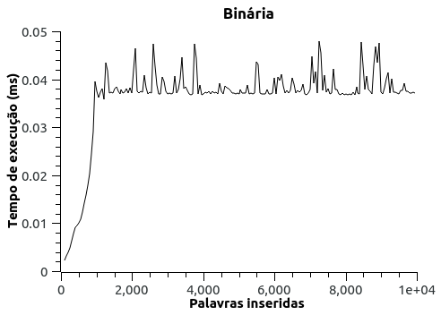
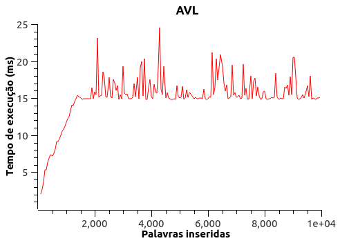

# Trabalho de Aquecimento

## Introdução

Neste trabalho, o objetivo é criar um sistema que possibilite a funcionalidade de autocompletar
e oferecer sugestões de palavras aos usuários. Para atingir essa finalidade, adotaremos a
estrutura da árvore binária como base. Além disso iremos discutir 2 possibilidades de otimização. Utilizando uma árvore AVl e implementando uma codificação de Huffman.

### Observações

- O valor de K pode ser alterado dentro do arquivo `main.cpp`.
- Dentro das pasta `dataset` se encontra os arquivo `input.txt` e `stopwords.txt`.
- Os textos onde as palavras serão buscas devem estar dentro da pasta `./textos`.

## Implementação

O programa inicialmente irá buscar todos os textos que serão analisados. Em cada texto é contado a frequencia de todas as palavras, utilizando uma estrutura de hash. Optamos o uso do unordered_map, da biblioteca padrão, devido a confiabilidade em sua implementação.

Contablizadas as frenquencias percorres as palavras de entrada, essas foram anteriormentes lidas e salvas em um vetor. Para cada palavra criamos uma heap naquela texto, omitindo a palavra atual. O objetivo é conseguir separar as Top K palavras mais frequentes daquele texto. Esse parte da implementação foi desenvolvida em um trbalho anterior e reutilizada neste, assim os detalhes dessa etapa estão descritos no repositório [Top K Elemetos](https://github.com/tinicius/Aquecimento-AEDS-II).

Tendo as palavras mais frequentes inserimos elas nas estruturas de arvores. Por fim, percorres as arvores exibindo todos os elementos. Para o exibir os nós da árvore optamos por implementar o caminhamento em in-ordem. Esse processo consiste em exibir toda a subarvore esquerda de um nó, o valor do próprio nó e a subarvore direita, estritamente nessa ordem. Ao fim, teremos todos os valores em ordem crescente.

Para construção do programa foi implementado as seguintes estruturas:

### Árvore Binária Padrão

Uma Árvore Binária é uma estrutura de dados hierárquica que consiste em nós, onde cada nó tem no máximo dois filhos. Além disso todos os nós na subarvore esquerda são menor que o nó pai, de maneira análoga todo os nós da subarvore a direita são maiores que o pai. Esse propriedade da árvore binária é a base para duas aplicações principais, ordenação e busca binária.

O processo de inserção escolhido consiste em buscar em percorrer a árvore recursivamente, indo para a esquerda caso o item seja menor que o nó atual e direita caso o contrário, esse processo terminal a encontrar um nó vazio.

### Codificação de Huffman

A implementação da codificação de Huffman se baseia na construção de uma Árvore de Huffman, onde os símbolos mais frequentes em um conjunto de dados são representados por caminhos mais curtos na árvore, enquanto os símbolos menos frequentes têm caminhos mais longos.

Na implementação, começamos criando uma árvore binária onde cada nó representa um símbolo e sua frequência de ocorrência. Os nós são organizados em uma fila de prioridade onde os nós com menor frequência têm prioridade, esse trabalho optamos por utlizar a estrutura priority_queue para gerenciar nossa fila.

O proximo passo para a construção da Árvore de Huffman envolve a fusão de nós de menor frequência em um novo nó pai, continuando até que tenhamos uma única árvore.

Para buscar os códigos na ávore percorremos a árvore atribuindo códigos binários aos símbolos com base nos caminhos da raiz até as folhas. Sempre que caminhamo a esquerda adicionamos o digito 0 e ao ir para direito o digito 1.

### Árvore AVL

Uma Árvore AVL é uma estrutura de dados em forma de árvore binária que mantém um equilíbrio automático, garantindo que a altura da subárvore esquerda e direita de qualquer nó não difira em mais do que 1 nível.

A implementação de uma Árvore AVL requer que cada nó contenha informações sobre seu fator de equilíbrio, que é a diferença entre a altura da subárvore direita e esquerda. Na nossa implementação nomeados essa propriedade de altura.

Quando uma inserção ou remoção é realizada, a árvore é reequilibrada conforme necessário, através de rotações de nós, para garantir que o fator de equilíbrio de cada nó esteja dentro dos limites aceitáveis.

Existem quatro tipos principais de rotações em uma Árvore AVL.

**Rotação à Direita (Right Rotation - RR)** Essa rotação é aplicada quando a subárvore direita de um nó está mais alta do que a subárvore esquerda, resultando em um fator de equilíbrio igual a -2. A rotação à direita é usada para restaurar o equilíbrio, movendo o nó desequilibrado para a direita.

**Rotação à Esquerda (Left Rotation - LL)** Essa rotação é o oposto da rotação à direita e é aplicada quando a subárvore esquerda de um nó está mais alta do que a subárvore direita, resultando em um fator de equilíbrio igual a 2. A rotação à esquerda é usada para restaurar o equilíbrio, movendo o nó desequilibrado para a esquerda.

**Rotação Dupla à Direita (Double Right Rotation - RL)** Essa rotação é uma combinação de uma rotação à esquerda seguida por uma rotação à direita. Ela é aplicada quando o fator de equilíbrio de um nó está igual a -2 e o fator de equilíbrio de seu filho esquerdo está igual a 1. A rotação dupla à direita é usada para restaurar o equilíbrio.

**Rotação Dupla à Esquerda (Double Left Rotation - LR)** Essa rotação é o oposto da rotação dupla à direita e é aplicada quando o fator de equilíbrio de um nó está igual a 2 e o fator de equilíbrio de seu filho direito está igual a -1. A rotação dupla à esquerda é usada para restaurar o equilíbrio.

## Resultados

A **árvore binária** não garante nenhum tipo de equilíbrio, o que significa que, no pior caso, pode degenerar em uma lista ligada, levando as operações de busca, inserção e exclusão a terem complexidade $O(n)$.

A **árvore AVL** garante um balanciamento, onde a diferença entre as alturas das subárvores esquerda e direita de cada nó é mantida em no máximo 1. Isso garantes uma eficiencia mais nas operacoes de buscar, inserção e remoção, na classe de complexidade $O(log n)$. Porém, para se manter balanceada a AVL precisa armazenar seu fator de balanceamento, oque gera mais uso de memoria. Além disso as operações de rotação também iram gerar uma complexidade extra a estrutura.

Já a **codificação de Huffman** tem como finalidade a compressão de dados, ou seja, representar informações minimizando o número de bits necessários para representar os dados. A criação da arvore de huffman é bastante custosa devido as estruturas que são necessárias, como utilizamos uma heap a construção terá seu custo na classe $O(n log n)$. Para codificar as palavras temos que percorrer toda a arvore gerando um código de custo $O(n)$.

### Saída

O output do programa irá exibir para cada texto, e para cada palavra, 3 listas representas a saida de cada uma das estruturas. Abaixo segue um exemplo.

```
================================================================================================
Texto: ./textos/globalizacao.txt

Palavra: processo

Huffman: sistema 0000 formas 0001 melhoria 0010 É 0011 pode 0100 quadros 0101 impacto 0110 informações 0111 necessidade 1000 estabelecimento 1001 assim 1010 sentido 1011 sobre 11000 condições 11001 expansão 11010 atual 11011 importante 11100 modo 11101 podemos 11110 importância 11111
Binária: sobre 133 importante 133 atual 133 condições 133 expansão 133 podemos 134 pode 134 estabelecimento 134 formas 134 melhoria 134 quadros 134 impacto 134 necessidade 134 informações 134 modo 134 importância 134 sistema 134 É 134 assim 199 sentido 200
AVL: sobre 133 importante 133 atual 133 condições 133 expansão 133 podemos 134 pode 134 estabelecimento 134 formas 134 melhoria 134 quadros 134 impacto 134 necessidade 134 informações 134 modo 134 importância 134 sistema 134 É 134 assim 199 sentido 200

Palavra: assim

Huffman: formas 0000 importância 0001 necessidade 0010 informações 0011 pode 0100 quadros 0101 modo 0110 É 0111 impacto 1000 podemos 1001 sentido 1010 processo 1011 condições 11000 importante 11001 expansão 11010 geral 11011 sobre 11100 sistema 11101 estabelecimento 11110 melhoria 11111
Binária: geral 133 sobre 133 expansão 133 importante 133 condições 133 melhoria 134 impacto 134 pode 134 podemos 134 formas 134 quadros 134 necessidade 134 informações 134 estabelecimento 134 modo 134 importância 134 sistema 134 É 134 processo 200 sentido 200
AVL: geral 133 sobre 133 expansão 133 importante 133 condições 133 melhoria 134 impacto 134 pode 134 podemos 134 formas 134 quadros 134 necessidade 134 informações 134 estabelecimento 134 modo 134 importância 134 sistema 134 É 134 processo 200 sentido 200
================================================================================================
```

## Comparação AVL e Binária

A fim de testar a implementação das estruturas, e posteriormente fazer uma comparação, foram feito testes individuos analisando o tempo gasta para criar e popular cada árvore.

<table>
    <td>
      
     
    </td>
</table>

Para realizar os testes foram feitas medias alterando em cada uma delas a variável K, ou seja, o número de palavras sendo inseridas na estrutura. Foi possível confirmar o comportamento logaritmo nas duas estruturas como era esperado a partir da análise de complexidade do código.

|              | Binária | AVL |
| -----------------------| ----------------------------------- | --------- |
| Média de Tempo (ms) | 0.354220  |  15.830991  |
| Tempo máximo (ms) |  0.047982 | 24.545000|
| Tempo mínimo (ms) | 0.036736 | 14.823000 |

Podemos analisar o tempo médio de execução pegando os pontos após a estabilização, onde a função logaritma apresenta um comportamento próximo ao linear. Assim é possível perceber que mesmo visualmente o gráfico aparente muitas variações, estas representam diferenças muitas pequenas em tempo.

  

Para poder comparar os dois gráficos colocamos dados com um eixo y logaritmo, aproximando as curvas.

Por fim, além de conseguir analisar o comportamento dos gráficos, podemos perceber como a criação da AVL é bastante custusa comparado a binária. Isso se deve as rotações necessárias, oque não é realizado na binária. Entretanto essa diferença de custo na criação pode ser compensada nas buscas. A AVL terá um desempenho melhor em pesquisas por estar balanceada.

## Conclusão

Podemos concluir com esse trabalho que a implementação de uma árvore binária oferece simplicidade, mas não garante um desempenho eficiente em todas as situações. Pode ser adequada para pequenos conjuntos de dados, mas sua complexidade pode se tornar problemática em conjuntos maiores. A árvore AVL, por outro lado, oferece uma estrutura balanceada que garante uma eficiência mais previsível em operações de busca, inserção e remoção. Embora tenha um custo computacional ligeiramente maior, e um custo de armazenamento adicional, devido às rotações necessárias para manter o equilíbrio o que a torna mais adequada para conjuntos de dados maiores. A codificação de Huffman se concentra na compressão de dados, o que a torna valiosa em cenários onde economia de espaço é fundamental. No entanto, sua criação é custosa, mas a eficiência na redução de tamanho de dados compensa esse custo na transmissão e armazenamento de dados.

## COMPILAÇÃO E EXECUÇÃO

O algoritmo disponibilizado inclui um arquivo Makefile que facilita o processo de compilação e execução. Abaixo estão as diretrizes para compilar e executar o programa:
| Comando | Função |
| -----------------------| ------------------------------------------------------------------------------------------------- |
| `make clean` | Remove os arquivos gerados na última compilação, incluindo os arquivos na pasta "build". |
| `make` | Compila o programa usando o compilador `gcc` e coloca o resultado na pasta "build". |
| `make run` | Executa o programa compilado na pasta "build". |

## Contatos

<div style="display: inline-block;">
<a href="https://t.me/vini_apereira">
 
</a>
<a href="https://www.linkedin.com/in/vinicius-alves-pereira-913254236/">

</a>
</div>
<p> </p>
<a style="color:black" href="mailto:vinicius.apereira04@gmail.com?subject=[GitHub]%20Source%20Dynamic%20Lists">
✉️ <i>vinicius.apereira04@gmail.com</i>
</a>
